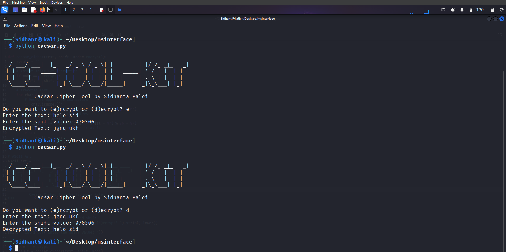
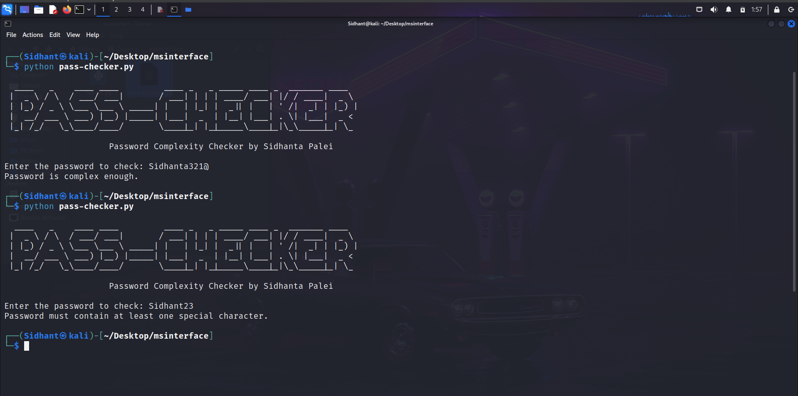
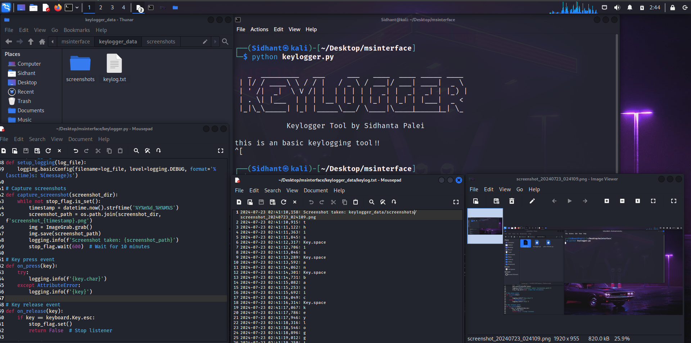

# Internship Tasks at MSInterface

Welcome to the repository documenting the tasks I completed during my internship at MSInterFace. This repository includes detailed descriptions, code samples, and other relevant information pertaining to the various projects and tasks I worked on.

## Table of Contents

- [Introduction](#introduction)
- [Tasks](#tasks)
  - [Task 1: Implement Caesar Cipher](#task-1-implement-caesar-cipher)
  - [Task 2: Password Complexity Checker](#task-2-password-complexity-checker)
  - [Task 3: Keylooger](#task-3-keylogger)
- [Getting Started](#getting-started)
- [Usage](#usage)
- [Contributing](#contributing)
- [License](#license)
- [Acknowledgements](#acknowledgements)

## Introduction

This repository contains the tasks and projects I completed during my internship at MSInterface. Each task is documented with descriptions, code snippets, and any other relevant information to help understand the work done and the results achieved.

## Tasks

### Task 1: Implement Caesar Cipher

**Description:**
- The Caesar cipher is a simple encryption technique where each letter in the plaintext is shifted a certain number of places down or up the alphabet.

**Objective:**
- To create a tool that can encrypt and decrypt text using the Caesar cipher technique.

**Implementation:**

The Caesar cipher implementation involves the following steps:

1. **Importing Prerequisites:**
   - In this case, we do not have any external libraries to import other than Python's built-in `string` module, but it is not necessary for this specific implementation.

2. **Defining the Function:**
   - We define a function `caesar_cipher` that takes three parameters: `text` (the input string), `shift` (the number of positions to shift the letters), and `mode` (either 'encrypt' or 'decrypt').

3. **Encrypting/Decrypting the Text:**
   - The function iterates over each character in the input `text`.
   - For uppercase letters, it shifts the ASCII value within the range of uppercase letters.
   - For lowercase letters, it shifts the ASCII value within the range of lowercase letters.
   - Non-letter characters are added to the result as-is.


4. **Adding ASCII Art:**
   - To give a professional touch to the tool, we add ASCII art displaying "CC-TOOL-KIT" and the author's name.

5. **User Interaction:**
   - The user is prompted to choose whether they want to encrypt or decrypt the text.
   - The user is then asked to enter the text and the shift value.
   - Based on the user's choice, the text is either encrypted or decrypted, and the result is displayed.

**Results:**


### Task 2: Password Complexity Checker

**Description:**
- This tool checks the complexity of a given password based on multiple criteria, including length, character types, and common passwords. It provides feedback to ensure that the password meets the required security standards.

**Objective:**
- To create a tool that verifies whether a password meets certain complexity requirements to ensure it is secure.

**Implementation:**

The password complexity checker performs the following steps:

1. **ASCII Art Header:**
   - Adds a professional header to the tool.

2. **Defining the Function:**
   - A function `check_password_complexity` checks if the password meets several criteria:
     - Minimum and maximum length.
     - Presence of uppercase letters, lowercase letters, digits, and special characters.
     - Not being a common password or containing common sequences.
    
3. **User Interaction:**
   - Prints the ASCII art header.
   - Prompts the user to enter a password and checks its complexity.

**Results:**


## Task 3: Keylogger

### Description
This task involves creating a keylogger that captures keystrokes and periodic screenshots, saving them to a dedicated directory. The tool is designed to be ready for use by others, ensuring it creates necessary directories and files automatically.

### Objective
To create a keylogger tool that logs keystrokes and takes periodic screenshots, storing them in a structured manner.

### Explanation

1. **ASCII Art Header**:
    - The `ascii_art` variable contains an ASCII art header that will be printed when the program starts, identifying the tool.

2. **Configuration**:
    - `BASE_DIR`, `LOG_FILE`, and `SCREENSHOT_DIR` are configured to set the paths for storing log files and screenshots.

3. **Global Stop Flag**:
    - `stop_flag` is a threading event used to signal when the keylogger should stop running.

4. **Setup Directories and Files**:
    - `setup_directories_and_files()` creates the necessary directories and log file if they do not already exist.

5. **Setup Logging**:
    - `setup_logging(log_file)` configures the logging module to write logs to `keylog.txt`.

6. **Capture Screenshots**:
    - `capture_screenshot(screenshot_dir)` is a function that captures a screenshot every 10 minutes and saves it to the specified directory. This function runs in a separate thread to ensure it operates concurrently with keylogging.

7. **Key Press and Release Events**:
    - `on_press(key)` and `on_release(key)` handle key press and release events, logging each keystroke. If the `esc` key is released, `on_release` sets the `stop_flag`, which signals the program to stop.

8. **Main Function**:
    - `main()` prints the ASCII art header, sets up directories and logging, starts the screenshot capturing thread, and initiates the keylogger using `pynput`'s `keyboard.Listener`.

9. **Program Entry Point**:
    - The `if __name__ == "__main__":` block ensures the `main()` function is called when the script is executed, starting the keylogger.

This implementation ensures the keylogger is ready for use by others, with directories and files being created automatically and clear logging of keystrokes and screenshots. The program can be stopped by pressing the `esc` key.

**Results:**


## Getting Started

To get a local copy of this project up and running on your machine, follow these steps:

1. **Clone the repository:**
    ```bash
    git clone https://github.com/yourusername/repositoryname.git
    ```
2. **Navigate to the project directory:**
    ```bash
    cd repositoryname
    ```
3. **Install the necessary dependencies:**
    ```bash
    pip install -r requirements.txt  # If using Python
    ```

*(Adjust the steps above according to the specific requirements of your project)*

## Usage

Provide instructions and examples for using the code or accessing the tasks documented in this repository. For example:

```bash
# Example command to run a script
python script_name.py
```

## Acknowledgements

- [MSInterface](https://msinterface.in/)
